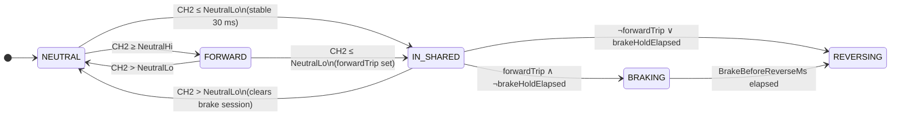

# Brake and reverse lights — specification

This document defines how **CH2 throttle PWM** is interpreted and how the **brake** and **reverse** lamps behave. It matches the implementation in `break_reverse.cpp` and the tunables in `rc_car_lights.ino`.

**Related:** pin map and system overview in `doc/technical.md`.

---

## 1. Scope

| In scope | Out of scope |
| -------- | -------------- |
| Brake lamp (D8), reverse lamp (D7) from CH2 only | ESC motor direction, braking force |
| Valid PWM 900–2100 µs; invalid → both lamps off | Turn signals, headlights, backfire |
| Sanwa RX472–style calibration on this car | Other receivers without recalibration |

**Goal:** Lights match driver intent:

- **Brake lamp** — braking after a forward run (entered shared range from forward).
- **Reverse lamp** — driving backward (same PWM range as brake; **not** a separate µs band).
- **No brake lamp** when only **coasting** (easing throttle toward center without entering the shared range).

---

## 1.1 Driver actions vs lamps

| Driver action | Stick / CH2 | Brake lamp | Reverse lamp |
| ------------- | ----------- | ---------- | ------------ |
| **Throttle forward** | Forward zone (≥ 1400 µs) | Off | Off |
| **Coast** | From forward down toward idle, still **> 1370** | **Off** | Off |
| **Brake** | Shared range (≤ 1370 µs) after forward | **On** (then off) | After hold timer |
| **Reverse** | Same shared range (1370 → MIN) | Off | **On** |

**Coast** never enters the shared range. **Brake** and **reverse** use the **same** CH2 values; firmware distinguishes them by **sequence and timing**, not by stick depth inside the shared band.

---

## 2. Throttle signal (CH2)

- **Pin:** D3 — `pulseIn(pinCh2, HIGH, 25000)` → µs
- **Valid:** 900–2100 µs → `BreakReverse::evaluate(CH2, millis())`
- **Invalid:** outside range → `BreakReverse::reset()` forces both lamps off

Brake and reverse share **one stick direction** on the transmitter. From **1370 µs down to the minimum valid pulse**, the same values mean “brake” or “reverse” depending on **what the driver just did** and **how long they hold**.

### 2.1 Main loop integration

Each `loop()` in `rc_car_lights.ino`:

1. Read CH2 with `pulseIn`.
2. If `isValidRcPulse(CH2)` → `breakReverse.evaluate(CH2, millis())`.
3. Else → `breakReverse.reset()`.

Low-voltage handler also calls `OnReverse(false)` and `OnBreak(false)` before skipping other logic.

---

## 3. PWM zones

Calibrated values in firmware — confirm on the bench (§7).

### 3.1 Constants

**Sketch tunables** (`rc_car_lights.ino` → `BreakReverse` constructor):

| Sketch name | C++ parameter | Value | Role |
| ----------- | ------------- | ----- | ---- |
| `NeutralLo` | `brakeReverseHi` | **1370** µs | Shared range: `CH2 ≤ NeutralLo` |
| `NeutralHi` | `forwardLo` | **1400** µs | Forward band: `CH2 ≥ NeutralHi` |
| `BrakeBeforeReverseMs` | `brakeBeforeReverseMs` | **2500** ms | Brake lamp time in shared range after forward |

**Fixed in `break_reverse.cpp`:**

| Constant | Value | Role |
| -------- | ----- | ---- |
| `FORWARD_HOLD_MS` | 120 ms | Forward band held this long → `forwardTrip` set |
| `SHARED_ENTER_HOLD_MS` | 30 ms | Continuous time in shared range before lamps on |
| `TRIP_CLEAR_MS` | 400 ms | Center-idle dwell to clear `forwardTrip` (coast path) |
| Center-idle offset | 12 µs | `inCenterIdle`: `CH2 > NeutralLo` and `CH2 + 12 ≥ NeutralHi` |

**Validation** (`rc_car_lights.ino`):

| Constant | Value |
| -------- | ----- |
| `RC_PULSE_MIN_VALID_US` | 900 |
| `RC_PULSE_MAX_VALID_US` | 2100 |

**Not used:** separate “deep reverse” µs threshold, band debounce, sticky shared latch, or serial debug/plotter in production firmware. Lamps follow **live CH2** every loop.

### 3.2 Zone map (three bands)

```
CH2 increases →

  PWM_MIN …  1370         1400    … PWM_MAX
      |---------|-----------|--------|
      BRAKE+REVERSE  NEUTRAL   FORWARD
      (shared)     (idle)    (throttle)
      ≤1370        1371–     ≥1400
                   1399
```

| Band | Condition | Typical CH2 |
| ---- | --------- | ----------- |
| **Shared** | `CH2 ≤ NeutralLo` | 1370 … 900 |
| **Neutral** | `NeutralLo < CH2 < NeutralHi` | ~1371–1399 (idle ~1389) |
| **Forward** | `CH2 ≥ NeutralHi` | 1400 … 2000+ |

There is **no** narrow brake-only gap between 1370 and a lower µs value. Light brake and full reverse are both ≤ 1370.

### 3.3 Idle vs entering the shared range

```
        NEUTRAL / idle              SHARED brake+reverse
        1371 … 1399                 ≤ 1370 … MIN
              |                           |
   coast ends │  idle (center)            │  brake or reverse
   (> 1370)  │  (~1389)                  │  (§3.4 picks lamp)
              └─ cross ≤1370 ────────────┘
```

| Region | Example | Meaning |
| ------ | ------- | ------- |
| **Idle (center)** | ~1380–1389 | No brake, no reverse |
| **Coast** | Forward → idle, CH2 never ≤ 1370 | No lamps; `forwardTrip` may stay set |
| **In shared range** | CH2 ≤ 1370 | Brake **or** reverse (§3.4) |

**Brake vs coast:** Brake requires **entry into CH2 ≤ 1370**, not merely “below forward (1400)”. Coasting toward idle stays above 1370 and must **not** trigger the brake lamp.

---

## 3.4 Brake vs reverse — rules (implemented)

PWM cannot distinguish brake from reverse inside the shared band.

| # | Rule | Brake | Reverse |
| - | ---- | ----- | ------- |
| R1 | `CH2 > NeutralLo` (neutral or forward) | Off | Off |
| R2 | Coast from forward (never ≤ 1370) | Off | Off |
| R3 | **Idle → shared**, no `forwardTrip` | Off | **On** (after 30 ms in shared) |
| R4 | **Forward → shared** (`forwardTrip` set) | **On** first | Off |
| R5 | Still in shared ≥ `BrakeBeforeReverseMs` after R4 | Off | **On** |
| R6 | Brake and reverse **never** on together | — | — |

### 3.4.1 Internal state

| Variable | Set when | Cleared when |
| -------- | -------- | ------------ |
| `forwardTrip` | CH2 in forward band ≥ 120 ms | Brake session abandoned (below); or 400 ms center idle |
| `brakeSessionFromForward` | In shared range while `forwardTrip` is true | Leaving shared after such a session; or center-idle clear |
| `sharedEnteredAt` | First sample in shared range | Any sample with `CH2 > NeutralLo` |
| `forwardHeldSince` | Enter forward band | Leave forward band |
| `centerIdleSince` | Enter center idle window | Leave center idle window |

**`forwardTrip`** means “driver was throttling forward recently.” It selects brake-before-reverse inside the shared band.

**`brakeSessionFromForward`** means “this shared-range visit started from forward.” When CH2 returns above `NeutralLo`, both `forwardTrip` and `brakeSessionFromForward` clear immediately so **brake → idle → reverse** behaves like **idle → reverse** (no stuck brake context).

**Center idle** (coast path only): `CH2 > 1370` and `CH2 ≥ 1388` (with current tunables). After **400 ms** there, `forwardTrip` clears even if the driver never entered shared range — so a long coast to center idle eventually drops forward context.

### 3.4.2 Glitch filter

Lamps turn on only when `sharedEnteredAt + 30 ms ≤ now` (continuously in shared range). Single-sample dips at the boundary do not flash a lamp. Outside shared range, both lamps are forced off every `evaluate()` call.

### 3.4.3 Behavior summary

| Path | Brake lamp | Reverse lamp |
| ---- | ---------- | ------------ |
| CH2 **> 1370** | Off | Off |
| Coast (forward, never ≤ 1370) | Off | Off |
| **Idle → shared** (no `forwardTrip`) | Off | On after 30 ms |
| **Forward (≥ 120 ms) → shared** | On until `BrakeBeforeReverseMs` | Then on |
| **Forward → brake → idle → shared** | Off | On after 30 ms |
| Invalid CH2 | Off | Off |

### 3.4.4 `evaluate()` logic (reference)

Order each loop:

```
updateForwardTrip(throttle, nowMs)
updateSharedTimer(throttle, nowMs)

brakeOn = reverseOn = false

if inSharedRange(throttle) AND sharedStable(nowMs):
  if NOT forwardTrip:
    reverseOn = true
  else if brakeHoldElapsed(nowMs):   // sharedEnteredAt + BrakeBeforeReverseMs
    reverseOn = true
  else:
    brakeOn = true

onBreak(brakeOn)
onReverse(reverseOn)
```

Helper definitions:

```
inSharedRange(t)     = t <= NeutralLo
inForwardRange(t)    = t >= NeutralHi
sharedStable(now)    = sharedEnteredAt > 0 AND now >= sharedEnteredAt + 30ms
brakeHoldElapsed(now)= sharedEnteredAt > 0 AND now >= sharedEnteredAt + BrakeBeforeReverseMs
inCenterIdle(t)      = t > NeutralLo AND t + 12 >= NeutralHi
```

---

## 4. Outputs

| Output | Pin | On | Notes |
| ------ | --- | -- | ----- |
| Brake | D8 | `HIGH` | `OnBreak()` → `digitalWrite` |
| Reverse | D7 | `HIGH` default | `setReverseLamp()`; `REVERSE_LED_ACTIVE_LOW` inverts if needed |

Mutually exclusive when on; invalid CH2 → both off via `reset()`.

---

## 5. Requirements checklist

### 5.1 Coast and idle

| # | Situation | Brake | Reverse |
| - | --------- | ----- | ------- |
| C1 | Idle (~1389 µs) | Off | Off |
| C2 | Coast: forward → idle, CH2 **> 1370** | Off | Off |
| C3 | Noise at idle, never stable ≤ 1370 for 30 ms | Off | Off |

### 5.2 Shared range (CH2 ≤ 1370 … MIN)

| # | Situation | Brake | Reverse |
| - | --------- | ----- | ------- |
| S1 | Full travel in shared range | Per §3.4 | Per §3.4 |
| S2 | No second µs threshold for “reverse depth” | — | — |

### 5.3 Must not

- Treat “below forward (1400)” alone as brake (coasting would false-trigger).
- Use a shallow brake zone between idle and “deep” reverse.
- Turn both lamps on at once.

---

## 6. State machine (logical)



Single `BreakReverse` class — no separate debug FSM in firmware.

---

## 7. Calibration

1. Move stick through idle, forward, brake, and reverse; record CH2 (scope, logic analyzer, or temporary `Serial.print` in `loop()`).
2. Set `NeutralLo` = measured entry into shared range (expect **~1370**).
3. Set `NeutralHi` = measured start of forward band (expect **~1400** on this car).
4. Tune `BrakeBeforeReverseMs` for brake-lamp duration before reverse after a forward run.
5. `throttleLo` / `throttleHi` in `Turns` are independent (turn-signal gating).

### 7.1 Measurements

| Stick position | CH2 (µs) |
| -------------- | -------: |
| Idle (center) | ~1389 |
| Coast (max forward, still no shared entry) | |
| First pull into shared range | ~1370 |
| Forward band start | ~1400 |
| Full reverse (in shared range) | |

---

## 8. Bench tests

| # | Sequence | Expected |
| - | -------- | -------- |
| T1 | Idle, hold | Both off |
| T2 | Idle → pull back (≤ 1370) | Reverse on after ~30 ms; no brake |
| T3 | Forward ≥ 120 ms → pull back | Brake on, then reverse after `BrakeBeforeReverseMs` |
| T4 | Forward → coast to idle (never ≤ 1370) | Both off throughout |
| T4b | T4 then pull back | Brake on (forwardTrip still set) |
| T5 | Forward → brake → idle → pull back | Reverse on; **no** brake (forwardTrip cleared) |
| T6 | Invalid / missing CH2 pulse | Both off |
| T7 | Idle boundary noise (< 30 ms dip ≤ 1370) | No lamp flash |

---

## 9. Non-goals

- Second PWM threshold inside ≤ 1370 for reverse (“deeper pull”).
- Byte-for-byte ESC double-tap / neutral-wait copy (hold timer in shared range after forward instead).

---

## 10. Lessons (wrong assumptions)

| Wrong assumption | Truth (this car) |
| ---------------- | ---------------- |
| Reverse lamp at lower µs than brake (e.g. ≤ 1350) | Brake and reverse share **1370 → MIN** |
| Narrow brake strip 1371–1379 | Below **1370** is one range; idle is **above** 1370 |
| Brake = “below forward” | Brake = shared range **with** `forwardTrip`, not coast |
| “Deeper pull” for reverse | Same range; use **sequence/time**, not depth |
| `forwardTrip` clears only after hard forward | Clears when leaving shared after forward-origin brake |
| Separate reverse band in PWM | Only one shared band; lamps differ by context |

---

## Revision history

| Date | Change |
| ---- | ------ |
| 2026-05-26 | Initial spec |
| 2026-05-26 | Shared brake+reverse range 1370→MIN; removed “deeper pull” model |
| 2026-05-26 | Implemented in `break_reverse.cpp` |
| 2026-05-26 | Synced to code: `NeutralHi` 1400, `BrakeBeforeReverseMs` 2500, `brakeSessionFromForward`, 30 ms entry hold, live CH2 |
| 2026-05-26 | Added implementation reference (§3.4.4), state table, bench tests (§8), main-loop integration (§2.1) |
