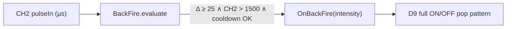

# RC car lights — technical overview

Firmware for an **Arduino Nano** (ATmega328P-class) that reads up to three RC receiver PWM channels, optionally monitors battery voltage on an analog pin, and drives several LED (or MOSFET) outputs with PWM where the hardware allows.

## Control flow

Each `loop()` iteration:

1. **Inputs** — `pulseIn(..., HIGH, 25000)` on D2, D3, and D4 captures the high pulse width of each channel (microseconds). Battery is read with `analogRead(7)` (see pin note below). Invalid CH2 pulses skip brake/reverse logic (see brake/reverse section).
2. **Low voltage** — If `LowVoltageDetector` decides the smoothed pack voltage is below the limit (default **6.8 V**, tuned for **2S** with a **÷2** divider), it flashes the turn outputs at ~1 Hz and **skips** all other logic for that pass.
3. **Otherwise** — Emergency modes on CH3 can force hazard-style blinking on the turn pins. If neither emergency band is active, **turn signals** use CH1 (steering) and CH2 (throttle) with a **3 s** dwell after throttle returns to “neutral.” **Headlights** (two behaviors), **backfire** exhaust pulse, and **brake / reverse** are derived from CH2 and CH3 thresholds defined in `rc_car_lights.ino`.

Modules are small `evaluate(...)` classes in the `.cpp` files included by the sketch; there is no separate build step beyond the Arduino IDE.

## CH3 (aux) pulse bands — one channel, several modes

All intervals are **open** (`low < pulse µs < high`), as in `Headlights` / `EmergencyLights` (`rc_car_lights.ino`).

### Timeline (typical servo-scale µs)

```
     1000      1200      1500      1600      1700      1900
       │         │         │         │         │         │
       ├─────────┤         │         │         │         │   Emergency 1  (1000…1200)
                 │         │         │         │         │
                 │◄─────── HL1 ─────────────────────────►│   Daylights    (1500…1900)
                 │         │         │                   │
                 │         │    ◄──── HL2 ──────────────►│   Xenon        (1600…1900)
                 │         │         │         │         │
                 │         │         │         ├─────────┤   Emergency 2  (1700…1900)
                 │         │         │         │         │
    ─────────────┴─────────┴─────────┴─────────┴─────────┴──► CH3 pulse width (µs)
```

`HL2` is fully inside `HL1`: xenon only turns on in the **upper** part of the daylight band.

### What is active in each band


| Region (µs) | Emergency (hazards)     | HLights1 daylights | HLights2 xenon |
| ----------- | ----------------------- | ------------------ | -------------- |
| 1000–1200   | Yes (`EmergencyLights`) | No                 | No             |
| 1200–1500   | No                      | No                 | No             |
| 1500–1600   | No                      | Yes                | No             |
| 1600–1700   | No                      | Yes                | Yes            |
| 1700–1900   | Yes (`…WithDaylights`)  | Yes                | Yes            |


Between **1200** and **1500** µs, **none** of these CH3-driven lighting/emergency modes apply; **turn signals** still follow **CH1 + CH2** when low-voltage is not latched.

## Backfire (exhaust) — CH2 throttle timing

The exhaust LED on **D9** (`pinExhaust`) is driven by `BackFire` in `backfire.cpp`, which runs once per `loop()` after each CH2 `pulseIn`. It is meant to mimic a brief exhaust **pop** when you **snap the throttle forward**, not a steady glow while you hold speed. Each pass compares the current throttle pulse width to the previous sample: if CH2 has risen by at least **25 µs** (`MIN_DELTA_US`), the pulse is above the forward threshold (**1500 µs**, `BackFire(1500, …)` in `rc_car_lights.ino`), and at least **350 ms** have passed since the last pop (`COOLDOWN_MS`), `OnBackFire` runs. Intensity is derived from how far above threshold you are: `(throttle − 1500) / 2`, clamped to **1…255**. Higher throttle at the moment of the snap yields more pops and slightly longer flashes; because the firmware drives the exhaust output full ON then OFF (no brightness ramp), brightness is always full ON/OFF and “intensity” only changes **pop count** and **timing** (see PWM note below). Releasing throttle, holding steady forward, or creeping up in tiny steps below 25 µs per loop does not retrigger until you accelerate again and the cooldown expires.

### CH2 regions relevant to backfire

Brake/reverse uses **`NeutralLo` / `NeutralHi`** (**1370 / 1390 µs** in `rc_car_lights.ino`); backfire only arms above **1500 µs** (well into forward travel).

```
      reverse / brake          neutral (BR)        forward (backfire zone)
    ◄──────────────────► ◄────────────► ◄──────────────────────────────►
    1000              1370        1390   1500                          1900+
         │                │           │      │                              │
         │                ├───────────┤      │◄── BackFire threshold ───────►│
         │                │ NeutralLo/Hi   │
    ─────┴────────────────┴───────────┴──────┴──────────────────────────────► CH2 (µs)
```

### When a pop triggers (one loop sample)

All three conditions must be true on the same `evaluate(CH2, millis)` call:

```
  previous sample          current sample
        │                        │
        │    Δ = CH2 − prev      │
        │◄──────────────────────►│
        │         Δ ≥ 25 µs      │
        │                        │
        └─ also: CH2 > 1500 µs
           also: now − lastFire ≥ 350 ms
                        │
                        ▼
                  OnBackFire(intensity)
```

Example: a throttle hit from neutral to mid-forward in one loop (large Δ) fires once; holding **1800 µs** steady does **not** fire every loop because Δ ≈ 0.

```
  CH2 (µs)
  1900 ┤                              ╭────────────  hold: Δ≈0, no new pop
  1800 ┤                         ╭────╯
  1500 ┤ - - - - - - - - - - - - ┼ - - - - - - - - -  threshold
  1390 ┤         neutral ═══════╪
  1370 ┤    ════════╯           │
       └────────────────────────┴──────────────────► time / loop iterations
              snap ↑              COOLDOWN (350 ms) before next snap can pop
              pop *               (only if Δ ≥ 25 µs again)
```

### Intensity → exhaust pattern

`OnBackFire` plays a short burst of full-on flashes on D9 (gaps use `random()` for variation).


| Intensity (from CH2) | Approx. CH2 at snap | Pops   | Notes                             |
| -------------------- | ------------------- | ------ | --------------------------------- |
| 1–70                 | ~1500–1640 µs       | 1      | Short single pop                  |
| 71–160               | ~1640–1820 µs       | 2      | Second pop slightly shorter       |
| 161–220              | ~1820–1940 µs       | 3      | Tighter gaps when intensity > 180 |
| 221–255              | ~1940+ µs           | 3 or 4 | ~35% chance of a 4th pop          |


```
  D9 (exhaust LED)
  ON  ┤ ████░░░░░████░░░░░████░░░████   ← more pops + shorter gaps at high intensity
  OFF ┤     ░░░     ░░░     ░░   ░
      └─┬───┬───┬───┬───┬───┬───┬───► time
        │flash│ gap │flash│ ...
        10–30 ms   20–65 ms (gaps shrink at intensity > 180)
```

Typical total burst length is on the order of **50–150 ms** (blocking `delay` in `OnBackFire`); other outputs are not updated until the burst finishes.

### Flow (detection → LED)



## Brake and reverse lights — CH2 throttle logic

Each `loop()`, after a valid CH2 pulse is captured (`pulseIn` on **D3** with a **25 ms** timeout; pulses outside **900…2100 µs** are ignored and both brake and reverse outputs are forced off), `BreakReverse` in `break_reverse.cpp` classifies throttle into three bands using `NeutralLo` / `NeutralHi` from `rc_car_lights.ino` (calibrated **1370** and **1390 µs**, open interval on neutral): **reverse** when `CH2 ≤ 1370`, **neutral** when `1370 < CH2 < 1390`, **forward** when `CH2 ≥ 1390`. Set `REVERSE_LED_ACTIVE_LOW` in `rc_car_lights.ino` if the reverse channel uses an inverted driver (brake on **D8** uses `HIGH` = on). The brake lamp (**D8**) and reverse lamp (**D7**) follow this state machine so the lights *mimic* common ESC “brake before reverse” behavior using only the receiver throttle PWM.

After the stick has been in **forward**, pulling below `NeutralHi` starts a **brake session**: brake ON while CH2 stays below forward and outside the idle window at the top of the neutral band (`CH2 ≥ NeutralHi − 25` inside neutral ends the session). Returning to **forward** (`CH2 ≥ NeutralHi`) turns the brake off. From **forward** into the **reverse** band, the firmware enters **BREAKING** first (brake ON, reverse OFF). If the stick stays in reverse for longer than `breakTimeout` (default **2200 ms**), the state becomes **REVERSING** (brake OFF, reverse ON). A latch keeps reverse lights stable across brief noise until neutral or **400 ms** outside the reverse band. `OnReverse` and `OnBreak` each drive only their own pin. State updates use **50 ms** debounce only while CH2 stays in the same band; band changes apply immediately so fast FWD→brake snaps are not missed. From **neutral** straight into reverse (no prior forward), reverse lights can turn on without a brake phase.

That model aligns in spirit with how many car ESCs behave in **“Forward/Reverse with Brake”** mode, but it is **not** a byte-for-byte copy of ESC firmware. Manufacturer docs (e.g. Hobbywing, Speed Passion Reventon, RC4WD Outcry) describe a **double-tap** or **neutral-wait** sequence: the first pull into the brake/reverse side of the stick applies **braking only**; actual reverse often requires a **second** tap or returning to **neutral** until a **reverse delay** elapses (Tekin’s default **Forward/Brake with Reverse Delay** is about **0.75 s** at neutral, programmable roughly **0–2 s**; ArduPilot rover notes often cite ~**0.3 s** as a typical minimum). Many ESCs also refuse reverse until the motor has **stopped**. This project instead uses a **single** continuous reverse-band reading after forward travel, a **fixed 2.2 s** brake-hold timer (`breakTimeout`), and does **not** require passing through neutral or a second trigger—so brake/reverse **LED timing can differ** from when the ESC actually applies reverse torque, especially if the ESC delay is reprogrammed or the car is still coasting. Adjust `NeutralLo`, `NeutralHi`, and `breakTimeout` in the INITIALIZATION section of `rc_car_lights.ino` to match your receiver endpoints and how long you want brake lights before reverse lights; use `Debug` and Serial at **9600 baud** to read live CH2 values while moving the stick through neutral, forward, and reverse.

```
  CH2 stick ──►  FORWARD (≥1390) ──► pull to reverse (≤1370)
                      │                      │
                      │                      ▼
                      │              BREAKING (brake LED, ~breakTimeout)
                      │                      │
                      │                      ▼ (timer expired, still in reverse band)
                      │              REVERSING (reverse LED)
                      │
  NEUTRAL (1370…1390) ──► reverse band ──► REVERSING immediately (no brake phase)
```

## Pin assignment (as in `rc_car_lights.ino`)


| Arduino label | Variable / role    | Direction    | Notes                                            |
| ------------- | ------------------ | ------------ | ------------------------------------------------ |
| **D2**        | `pinCh1`           | Input        | Servo / steering PWM from receiver               |
| **D3**        | `pinCh2`           | Input        | Throttle PWM                                     |
| **D4**        | `pinCh3`           | Input        | Aux / mode PWM (headlights, emergency bands)     |
| **A7**        | `pinVoltageMetter` | Analog in    | Battery sense (**not** D7 — see below)           |
| **D5**        | `pinLeft`          | Output (PWM) | Left turn                                        |
| **D6**        | `pinRight`         | Output (PWM) | Right turn                                       |
| **D7**        | `pinReverse`       | Output       | Reverse lamp (`digitalWrite`; see PWM note)      |
| **D8**        | `pinBreak`         | Output       | Brake lamp (`digitalWrite`; HIGH = on)           |
| **D9**        | `pinExhaust`       | Output       | “Backfire” / exhaust LED                         |
| **D10**       | `pinLights2`       | Output (PWM) | “Xenon” channel (blink on/off)                   |
| **D11**       | `pinLights1`       | Output (PWM) | Daylight fade with rear                          |
| **D12**       | `pinLightsR`       | Output       | Rear red / tail (faded with D11 in software)     |


### Analog channel vs digital pin 7

On the Nano, `**analogRead(7)` reads physical pin A7** (ADC channel 7). `**pinReverse` uses digital D7**. They are different pins; do not tie battery sense to D7.

### PWM behavior

Hardware PWM on the Nano: **D5, D6, D9, D10, D11** (and D3 if unused). **D7, D8, D12** are not hardware-PWM pins; `analogWrite` on those resolves to full **ON** for any non-zero duty cycle, so brightness curves on D7/D8/D12 are effectively on/off unless you change pins or use soft-PWM.

## Wiring (high level)

- **Receiver** — Connect **signal** wires for the three used channels to **D2, D3, D4**. Tie **GND** between receiver, ESC, and Arduino. Keep **5 V** to the receiver only if your receiver is 5 V-tolerant and your supply is clean (many installs use the BEC from the ESC).
- **Battery monitor** — Scale pack voltage so the Arduino analog pin never exceeds **5 V**. For **2S**, a **two-resistor divider** (e.g. two **1 kΩ** as in the project README) from pack+ to GND, **midpoint to A7**, is appropriate. Common **GND** with the pack and Arduino.
- **Loads** — Arduino pins source limited current. For real automotive or high-power LEDs, drive **gates of N-channel MOSFETs** (or low-side switches) from these pins, with **flyback** where needed, **current limiting** on LEDs, and a **common ground** with the Arduino.

## Calibration

Pulse width thresholds are tuned for a **Sanwa RX472**-style receiver. Set `Debug` to `true`, use **9600 baud** Serial, and adjust values in the **INITIALIZATION** section of `rc_car_lights.ino` if your endpoints differ.

### CH2 throttle constants (as calibrated in firmware)


| Constant | Value (µs) | Used by | Meaning |
| -------- | -----------: | ------- | ------- |
| `NeutralLo` | **1370** | `BreakReverse` | Reverse band: `CH2 ≤ NeutralLo` |
| `NeutralHi` | **1390** | `BreakReverse` | Forward band: `CH2 ≥ NeutralHi`; between Lo and Hi = neutral |
| `breakTimeout` | **2200** (ms) | `BreakReverse` | Brake LED duration in reverse band before reverse LED |
| `throttleLo` | **1350** | `Turns` | Turn signals: throttle must be above this |
| `throttleHi` | **1450** | `Turns` | Turn signals: throttle must be below this (3 s dwell) |
| `BackFire(1500, …)` | **1500** | `BackFire` | Exhaust pop when CH2 rises above this |

`NeutralLo` / `NeutralHi` and `throttleLo` / `throttleHi` are separate on purpose: brake/reverse vs turn-signal “standstill” gating. Align them with debug readings if your transmitter differs.

## Dependencies

- **[NeoTimer](https://github.com/jrullan/neotimer)** — non-blocking blink timing for turn / hazard / low-voltage patterns.

